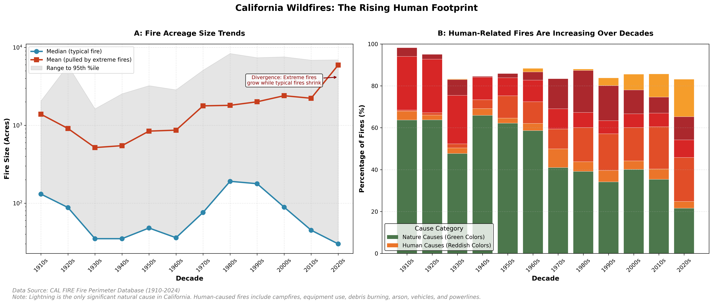

# **California Residents Can Monitor Possible Wildfire Sizes Using New Predictive Model**

Date: Mar 15, 2028

## Hook

How can California residents stay informed about how large a wildfire might become once it starts? With wildfires becoming increasingly common and destructive in the state of California, a new predictive model has been developed to help residents monitor the potential size and severity of wildfires based on seasonality, weather conditions, and human activity patterns. This model helps residents and public safety to enforce preventive measures and stay safe during wildfire season.

## Problem Statement

Wildfires are a growing concern in California, causing damage to homes, communities, and the environment. While there are ways to estimate where fires might start, it is much harder to know how large and dangerous a fire could become after ignition. This makes it difficult for emergency responders and local communities to prepare effectively. A small fire may be contained quickly, while a larger one can spread rapidly and cause widespread damage. Predicting wildfire size and severity after ignition may help authorities allocate resources more effectively, issue timely warnings to residents, and implement preventive measures to reduce the likelihood of wildfires. Currently, the limited access to such predictive models for California residents hinders their ability to stay informed and prepared during wildfire season. This raises the question: How can we develop a predictive model that uses weather conditions, time patterns, and ignition causes to provide estimates of wildfire size for California residents? By addressing this problem, we can help inform public safety strategies and mitigate the impact of wildfires in California.

## Solution Description

We developed a predictive tool that estimates how large a wildfire could become using historical data from across California. It looks at factors that influences how fires grow, specifically analyzing weather conditions, time patterns, and the cause of ignition. By processing these patterns, the tool can provide an early estimate of how severe a wildfire may become shortly after it begins. This information can be accessed by residents through a user-friendly interface, allowing them to stay informed about nearby fires and their respective sizes. As these stakeholders now have an informative tool, communities can take appropriate precautions to stay safe during wildfire season and emergency responders can act more quickly to effectively allocate resources during wildfire season.

## Chart

The two-panel figure reveals how California wildfires have grown both more severe and more human-driven over time. Together, these trends underscore the growing human footprint on California's wildfire landscape and the urgent need for predictive tools that can help residents and responders anticipate which fires may become catastrophic.

