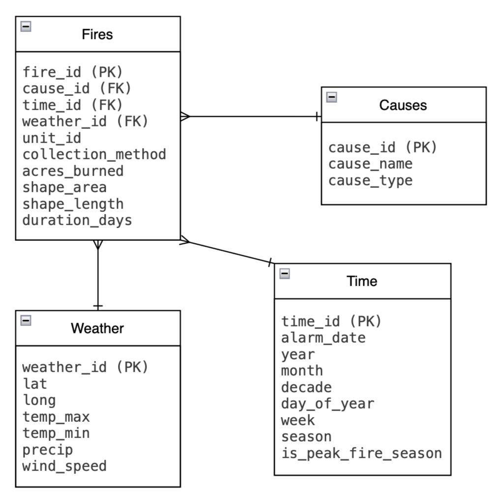

# DS4320 Project1: Predicting California Wildfire Burn Area Using Causal, Temporal, and Weather Data

### Executive Summary

This project focuses on predicting wildfire burn area in California using historic wildfire incident data from CAL FIRE. By integrating factors such as human activity, temporal features, and weather conditions, the project develops a relational database to organize wildfire records and conduct analysis. A predictive modeling pipeline is then applied to estimate wildfire size and identify the most influential drivers of fire severity. The repository includes the data acquisition and preprocessing code, links to the data in parquet format, supplemental materials, and the predictive modeling pipeline. Ultimately, the project aims to provide insights into the factors that contribute to wildfire size, helping inform public safety strategies for wildfire prevention and mitigation in California.

---
# Project Details

| Spec | Value |
|---|---|
| Name | Jessica Ni |
| NetID | dkh8my |
| DOI | [https://doi.org/10.1000/182](https://doi.org/10.1000/182) |
| Press Release | [California Residents Can Monitor Possible Wildfire Sizes Using New Predictive Model](https://github.com/hzheni/DS4320_Project1/blob/main/Press_Release.md) |
| Data | [Link to Data](https://myuva-my.sharepoint.com/:f:/g/personal/dkh8my_virginia_edu/IgCDBDKHn2iQSLx11w3ZwSp-AeE08wuRMYk7DauCEA86nws?e=7KTz9U) |
| Pipeline | [Problem Solution Pipeline Code](Problem_Solution_Pipeline.ipynb)   [Problem Solution Pipeline Markdown](Problem_Solution_Pipeline.md) |
| License | [MIT LICENSE](./LICENSE) |

---

## Problem Definition
### General and Specific Problem
* **General Problem:** Predicting wildfire risk
* **Specific Problem:** Predicting wildfire size (acres burned) in California based on human activity, temporal factors, and weather conditions

### Rationale
The general problem of predicting wildfire risk is broad and encompasses many unknowns of where and what fires to focus on. To make the problem more focused and actionable, I refined it to specifically predict wildfire size (acres burned) in California based on human activity, temporal factors, and weather conditions. This refinement allows us to focus on specific, measurable factors that are known to influence wildfire size, such as temperature, wind speed, and human activities like campfires or smoking. By narrowing the scope to California, we can also focus on region-specific data for more accurate predictions instead of trying to generalize results across different regions with varying wildfire dynamics. This refined problem statement is more actionable as it provides a clear target variable (wildfire size) and specific predictors (human activity, temporal factors, and weather conditions) that can be used to develop a predictive model. 

### Motivation
According to the National Interagency Fire Center, the state of California leads the country with the most wildfires. Wildfires can cause significant damage to public areas, ecosystems, and human health. Predicting wildfire size can help authorities allocate resources more effectively, issue timely warnings to residents, and implement preventive measures to reduce the likelihood of wildfires. Overall, understanding the factors that contribute to wildfire size and being able to predict it can help inform public safety and mitigate any negative impacts of wildfires in the future.

### Press Release Headline and Link
[**California Residents Can Monitor Possible Wildfire Sizes Using New Predictive Model**](https://github.com/hzheni/DS4320_Project1/blob/main/Press_Release.md)

## Domain Exposition
### Terminology

| Term | Definition |
|------|------------|
| Wildfire | An uncontrolled fire occurring in vegetation, often influenced by weather, human activity, and natural causes. |
| Wildfire Ignition Risk | The likelihood of a wildfire starting in a given area based on various factors such as weather conditions and human activity. |
| Burn Area | The area of land that has been affected by a wildfire, often measured in acres or hectares. |
| Causal Factors | Human or natural activities that can ignite or influence the spread of a wildfire (e.g., campfires, lightning, equipment use). |
| Temporal Factors | Time-related factors such as seasonality, time of day, and historical wildfire patterns that can influence wildfire ignition risk. |
| Weather Conditions | Environmental factors such as temperature, humidity, wind speed, and precipitation that can influence wildfire ignition risk. |
| Fire Weather Index | A numerical index that combines various weather factors to assess the potential for wildfire ignition and spread. |
| Predictive Model | A computational model that uses historical data to make predictions about future events, in this case, the size of wildfires. |
| California | A state in the United States that is particularly prone to wildfires due to its climate and vegetation. |

### Domain Explanation
This project lives in the domain of environmental science and public safety. On the environmental side, it focuses on understanding and predicting wildfire burn risk based on weather conditions, time factors, and human or nature related activity. The project involves utilizing historical wildfire incident data to understand the relationships between these factors and wildfire size, and then using this understanding to develop a predictive model that can inform residents and authorities about wildfire size risk in California. In the public safety domain, the project aims to provide actionable insights that can help guide preventive measures, resource allocation, and other public safety strategies to mitigate the impact of wildfires in California.

### Background Readings 
[Link to Github folder of PDFs](https://github.com/hzheni/DS4320_Project1/tree/main/Background%20Readings)

### Background Readings Table
| Title | Description | Direct Link | Link to File in Folder |
|-------|-------------|-------------|-------------------------|
| National Fire News | This website provides up-to-date information and statistics on wildfire incidents across the United States. It includes data on fire locations, sizes, and containment status. | [National Fire News](https://www.nifc.gov/fire-information/nfn) | [National Fire News](https://github.com/hzheni/DS4320_Project1/blob/main/Background%20Readings/National%20Fire%20News.pdf) |
| California Wildfire History & Statistics | This blogpost from Frontline Wildfire Defense provides a historical overview of wildfires in California, including statistics on California wildfire data measuring the impact that wildfires have on residents, structures, and the environment. It covers a few major wildfires in California history and provides lessons learned from those events. | [California Wildfire History & Statistics](https://www.frontlinewildfire.com/wildfire-news-and-resources/california-wildfires-history-statistics/) | [California Wildfire History & Statistics](https://github.com/hzheni/DS4320_Project1/blob/main/Background%20Readings/California%20Wildfires%20History%20and%20Statistics.pdf) |
| Recent advances in explainable Machine Learning models for wildfire prediction | This research highlights a machine learning model framework for wildfire forecasting and burned area estimation. It explores interactions between factors that contribute to model predictions and adopts a new method to show contributions of hyper-parameters on model learning. | [Recent advances in explainable Machine Learning models for wildfire prediction](https://www.sciencedirect.com/science/article/pii/S2590197425000485) | [Recent advances in explainable Machine Learning models for wildfire prediction](./Background%20Readings/Recent%20advances%20in%20explainable%20Machine%20Learning%20models%20for%20wildfire%20prediction.pdf) |
| How do Wildfires Start? | This article from Climate Check explains the various ways that wildfires can start, including natural causes like lightning and human activities such as campfires, fireworks, and outdoor burning. It also discusses the conditions that can contribute to wildfire ignition and spread. | [How do Wildfires Start?](https://climatecheck.com/risks/fire/how-do-wildfires-start) | [How do Wildfires Start?](./Background%20Readings/How%20do%20Wildfires%20Start.pdf) |
| Inference of Wildfire Causes From Their Physical, Biological, Social and Management Attributes | This research article explores machine learning approaches to analyze data and identify patterns that can help infer the causes of wildfires. It is based off the prevention of human-caused wildfires, which account for >60% of ignitions across western United States (WUS), as an effective way of reducing wildfire risk. | [Inference of Wildfire Causes From Their Physical, Biological, Social and Management Attributes](https://agupubs.onlinelibrary.wiley.com/doi/full/10.1029/2024EF005187) | [Inference of Wildfire Causes From Their Physical, Biological, Social and Management Attributes](./Background%20Readings/Inference%20of%20Wildfire%20Causes%20From%20Their%20Physical,%20Biological,%20Social%20and%20Management%20Attributes.pdf) |

## Data Creation
### Data Acquisition
The primary dataset used for this project is the California Department of Forestry and Fire Protection (CAL FIRE) Fire and Resource Assessment Program (FRAP) Wildfire Perimeters dataset. This dataset is maintained and updated annually by CAL FIRE in collaboration with the United States Forest Service Region 5, Bureau of Land Management, California State Parks, National Park Service, and the United States Fish and Wildlife Service. It provides a historical record of wildland fire perimeters across public and private lands in California, covering incidents dating back to 1878. For this project, the data was downloaded from the California Open Data Portal, which hosts the "California Fire Perimeters (all)" dataset in CSV format. The dataset was preprocessed to extract relevant columns for modeling fire size and attributes were normalized into separate relational tables to allow for more flexible analysis.

A secondary dataset used in this project is "CAL FIRE Administrative Units" dataset which provides information on the administrative units responsible for fire management in California. This dataset was also obtained from the California Open Data Portal, but downloaded in shapefile format. It was used to gain insights into the approximate locations of fire agencies and the areas they cover.

[Link to California Fire Perimeters (all)](https://data.ca.gov/dataset/california-fire-perimeters-all)

[Link to CAL FIRE Administrative Units](https://data.ca.gov/dataset/cal-fire-administrative-units)

### Code
| File Name              | Description           | Link           |
| ---------------------- | --------------------- | -------------- |
| data_load_process.ipynb | This notebook contains the pipeline for loading the *California Fire Perimeters* and *CAL FIRE Administrative Units* dataset, cleaning and transforming the data, creating normalized tables (Fires, Causes, Agency, Time), and building the relational database in DuckDB. | [GitHub Link](https://github.com/hzheni/DS4320_Project1/blob/main/data_load_process.ipynb) |

### Bias Identification
The FRAP wildfire perimeter dataset is comprehensive, but there are a few aspects from the data collection process could introduce bias. First, historical records may be incomplete, especially for smaller fires that did not meet minimum mapping thresholds or for older incidents where documentation may have been lost or damaged. This could lead to selection bias, as smaller or less-reported fires may be underrepresented in the dataset, skewing analyses. Additionally, measurement bias could occur when sizes, perimeters, or methods used to map fires have evolved over time. For example, older fires may have been mapped using less precise methods, leading to inaccuracies in recorded fire size or perimeters. Furthermore, the dataset relies on multiple agencies and methods for data collection (e.g., remote sensing, field reporting), so differences in data collection protocols could create inconsistencies across fires. Large or complex fires may have been generalized in the mapping process, resulting in systematic errors in the measurement of fire size or perimeter. Lastly, due to the participation of many agencies and the nature of fire reporting, reporting bias may exist in categorical attributes, such as cause. Certain causes may be underreported due to investigation limitations, leading to more "unknown" entries. Overall, these biases relating to the accuracy and completeness of the data could influence the analyses, model predictions, and interpretation of the results.

### Bias Mitigation
Selection bias can be mitigated by focusing analyses on larger fires above a certain size threshold, noting this limitation in the interpretation of results, and ensuring that the dataset includes only incidents that are consistently reported and mapped. In addition, filtering the dataset to include only fires from a certain time period (e.g., the last 20 years) can help ensure that the data is more complete and consistent, as older records may be less reliable. Alternatively, analysts can create a flag for "unknown or missing data" to explicitly account for gaps in reporting. Measurement bias can be addressed by performing descriptive checks, such as removing extreme outliers in acres_burned or comparing distributions over time to identify potential inconsistencies. For modeling, log-transforming acres_burned can reduce the influence of very large fires and improve prediction stability. Reporting bias in categorical variables can be mitigated by normalizing and grouping categories logically (ex. grouping rare causes into "Miscellaneous" or unknown categories). Finally, quantifying uncertainty for numerical features such as acres_burned or duration_days by computing standard deviations or confidence intervals can express the range of expected values and provide a measure of reliability for model predictions and any analysis.

### Rationale for Critical Decisions
When creating the dataset and designing the relational schema, there were several critical decisions related to data selection, transformation, and organization that could introduce or mitigate uncertainty. The decision to exclude certain columns from the `fires` table was made to focus on features that are most relevant for modeling fire size. However, this could introduce uncertainty if potentially predictive or relevant information is omitted. To address this, key attributes providing context (like `cause` and `agency`) were retained, while excluded columns were primarily descriptive, such as labels or titles, rather than intrinsic characteristics of the fire that could directly influence its size. Additionally, the mapping of numeric cause codes to descriptive names in the Causes table was a judgement call that could introduce uncertainty if the mapping is not accurate or contained inconsistencies in how causes are reported. To ensure accuracy, the cause codes from official CALFIRE documentation containing the data dictionary and domain information were cross-referenced. Imputed values for missing data, such as using "Unknown" for missing causes or imputing duration of fires, were also a judgement call that could introduce uncertainty. While this allows for the inclusion of all records in the analysis, it may mask underlying patterns in the data. Lastly, there were assumptions made when creating the temporal features, such as defining seasons based on calendar months, which may introduce uncertainty if the season definitions do not align with actual fire behavior patterns. To address this, standard meteorological definitions of seasons (e.g., December-February as Winter) were used, but it's important to acknowledge that fire seasons can vary regionally and temporally. Overall, being transparent about these decisions and their potential impacts on the analysis helps to contextualize the results and manage uncertainty effectively.

## Metadata
### Schema ERD

### Data Table

| Table Name | Description | Link to Parquet |
|------------|-------------|-------------|
| Fires | This is the main table containing information about individual wildfire records in California, including size (acres burned), duration, and other fire-specific characteristics. It links to Cause, Weather, and Time tables via foreign keys. | [Fires.parquet](https://myuva-my.sharepoint.com/:u:/g/personal/dkh8my_virginia_edu/IQApmf0MB6NkQK7MqEYwlVddAY5AYAbT0qkseTH8VORLGmI?e=PFr6hg) |
| Causes | This table contains unique fire causes, with a mapping from numeric cause codes to descriptive names. It serves as lookup table describing the cause of each wildfire, including both detailed cause names and broader classifications (e.g., human vs natural). | [Causes.parquet](https://myuva-my.sharepoint.com/:u:/g/personal/dkh8my_virginia_edu/IQClh_cav7JwTbcUGg2T6JB6AYM3DP1lYVBWYoQrBsrTFyA?e=ipL794) |
| Weather | This table information about approximate weather conditions at the time of each fire, including temperature, precipitation, and wind speed. | [Weather.parquet](https://myuva-my.sharepoint.com/:u:/g/personal/dkh8my_virginia_edu/IQAZx47hY_9YTq2-cdsOjc9SAQdVwbl0yFSfpgEBxnfYRdQ?e=Uvqhjq) |
| Time | This table contains time-related attributes derived from the fire alarm dates, including year, month, season, and other temporal features. It allows for temporal analysis of wildfire patterns. | [Time.parquet](https://myuva-my.sharepoint.com/:u:/g/personal/dkh8my_virginia_edu/IQAUKgl5mmQbQLgn7TG8MKJnAfBp9gACRTszRS8Dk6vrw9o?e=28oyZE) |

### Data Dictionary

**Fires Table**

| Name              | Data Type | Description                                               | Example |
| ----------------- | --------- | --------------------------------------------------------- | ------- |
| fire_id           | Integer   | Unique identifier for each wildfire                       | 1   |
| cause_id          | Integer   | Foreign key linking to the cause of the fire              | 2       |
| time_id           | Integer   | Foreign key linking to time information                   | 3    |
| weather_id        | Integer   | Foreign key linking to the weather information   | 4       |
| unit_id           | String    | Abbreviated key representing each of 21 operational units that are designed to address fire suppression over a certain geographic area | LAC |
| collection_method | String    | The method used to collect data on perimeter of fire              | GPS Air	   |
| acres_burned      | Float     | GIS calculated total area burned by the fire (in acres)        | 14056.26   |
| shape_area        | Float     | GIS-calculated area of the fire perimeter                 | 494608.2 |
| shape_length      | Float     | GIS-calculated perimeter length of the fire               | 16094.2    |
| duration_days     | Float     | Number of days from alarm to containment date of the fire                 | 24       |

**Causes Table**

| Name       | Data Type | Description                                       | Example   |
| ---------- | --------- | ------------------------------------------------- | --------- |
| cause_id   | Integer   | Unique identifier for fire cause                  | 1         |
| cause_name | String    | Description of the fire cause                     | Lightning |
| cause_type | String    | Broad category of cause (Natural, Human, Unknown) | Natural   |

**Weather Table**

| Name             | Data Type | Description                  | Example             |
| ---------------- | --------- | ---------------------------- | ------------------- |
| weather_id       | Integer   | Unique identifier for weather record | 1       |
| lat              | Float     | Latitude of the fire location | 38.739850             |
| long             | Float     | Longitude of the fire location | -122.411749           |
| temp_max         | Float     | Maximum temperature at the time of the fire (°C) | 29.8   |
| temp_min         | Float     | Minimum temperature at the time of the fire (°C) | 12.5   |
| precip           | Float     | Precipitation at the time of the fire (mm)        | 0.0   |
| wind_speed       | Float     | Wind speed at the time of the fire (km/h)         | 20.9  |

**Time Table**

| Name             | Data Type | Description                                          | Example    |
| ---------------- | --------- | ---------------------------------------------------- | ---------- |
| time_id          | Integer   | Unique identifier for time record                    | 1       |
| alarm_date       | Date      | Date when the fire was first reported                | 2025-01-07 08:00:00 |
| year             | Integer   | Year of the fire                                     | 2020       |
| month            | Integer   | Month of the fire (1–12)                             | 7          |
| season           | String    | Season of the fire (Winter, Spring, Summer, Fall)    | Summer     |
| decade           | Integer   | Decade of the fire                                   | 2020       |
| day_of_year      | Integer   | Day of the year (1–366)                              | 197        |
| week             | Integer   | Week of the year                                     | 29         |
| peak_season_flag | Integer   | Indicator for peak wildfire season (1 = yes, 0 = no) | 0          |

### Data Dictionary Uncertainty Quantification

**Fires Table**

| Feature Name      | Uncertainty Quantification                                                                               |
| ----------------- | -------------------------------------------------------------------------------------------------------- |
| collection_method | ~28% missing; uncertainty arises from incomplete reporting rather than numeric error.                    |
| acres_burned      | ±0–10% depending on fire size and GIS boundary precision; larger fires may have higher estimation error. |
| shape_area        | ±1–5% due to GIS resolution, projection differences, and boundary estimation.                            |
| shape_length      | ±2–8% due to sensitivity to boundary complexity and spatial resolution.                                  |
| duration_days     | ~28% missing; imputed values may introduce high uncertainty (up to ±100% for missing cases).             |

**Causes Table**

| Feature Name | Uncertainty Quantification                                                                                 |
|--------------|------------------------------------------------------------------------------------------------------------|
| cause_id     | ±0 (exact value); unique identifier for each cause.                                                        |

**Agency Table**

| Feature Name | Uncertainty Quantification                                                                                 |
|--------------|------------------------------------------------------------------------------------------------------------|
| weather_id   | ±0 (exact value); unique identifier for each weather record.                                                 |
| lat          | ±0.01° due to GPS accuracy; may translate to ~1 km uncertainty on the ground.                                |
| long         | ±0.01° due to GPS accuracy; may translate to ~1 km uncertainty on the ground.                                |
| temp_max     | ±0.5–2°C depending on the source and method of measurement; may vary by location and time.                   |
| temp_min     | ±0.5–2°C depending on the source and method of measurement; may vary by location and time.                   |
| precip       | ±0–2 mm for daily total; uncertainty depends on sensor accuracy and missing precipitation events. |
| wind_speed   | ±1–3 km/h for daily max wind; uncertainty due to sensor accuracy, averaging over the day, and interpolation. |

**Time Table**
| Feature Name        | Uncertainty Quantification                                                                                     |
| ------------------- | -------------------------------------------------------------------------------------------------------------- |
| year                | ~0.01% missing (1 out of 6536 records); negligible uncertainty, primarily from rare missing alarm_date values. |
| month               | ~0.01% missing; inherits minimal uncertainty from alarm_date.                                                  |
| decade              | Derived feature; negligible uncertainty, propagates from year (~0.01% missing).                                |
| day_of_year         | ~0.01% missing; minimal uncertainty tied to alarm_date accuracy.                                               |
| week                | ~0.01% missing; derived from alarm_date with negligible uncertainty.                                           |
| is_peak_fire_season | ±0 (exact value); derived categorical indicator with no measurement error.                                     |